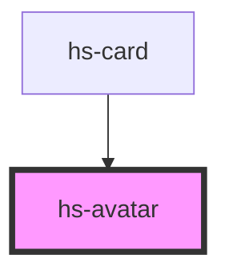

# hs-avatar

<!-- Auto Generated Below -->

## Properties

| Property       | Attribute      | Description | Type     | Default                                      |
| -------------- | -------------- | ----------- | -------- | -------------------------------------------- |
| `countryimage` | `countryimage` |             | `string` | `''`                                         |
| `image`        | `image`        |             | `string` | `'https://thispersondoesnotexist.com/image'` |

## Dependencies

### Used by

 - [hs-card](../hs-card)

### Graph

----------------------------------------------

*Built with [StencilJS](https://stenciljs.com/)*
