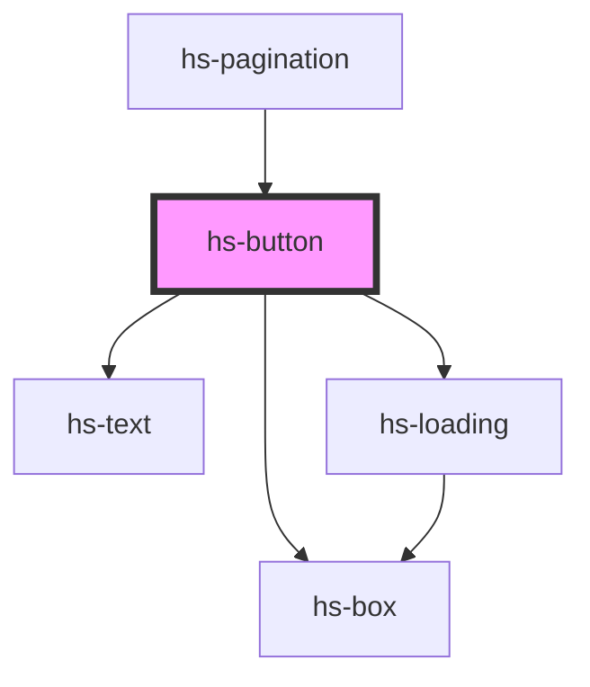

# hs-button

<!-- Auto Generated Below -->

## Properties

| Property   | Attribute  | Description | Type                       | Default     |
| ---------- | ---------- | ----------- | -------------------------- | ----------- |
| `color`    | `color`    |             | `"primary" \| "secondary"` | `'primary'` |
| `disabled` | `disabled` |             | `boolean`                  | `false`     |
| `icon`     | `icon`     |             | `string`                   | `''`        |
| `loading`  | `loading`  |             | `boolean`                  | `false`     |
| `size`     | `size`     |             | `"lg" \| "md" \| "sm"`     | `'md'`      |
| `type`     | `type`     |             | `"icon" \| "text"`         | `'text'`    |

## Events

| Event     | Description | Type               |
| --------- | ----------- | ------------------ |
| `clicked` |             | `CustomEvent<any>` |

## Dependencies

### Used by

 - [hs-pagination](../hs-pagination)

### Depends on

- [hs-box](../hs-box)
- [hs-text](../hs-text)
- [hs-loading](../hs-loading)

### Graph

----------------------------------------------

*Built with [StencilJS](https://stenciljs.com/)*
