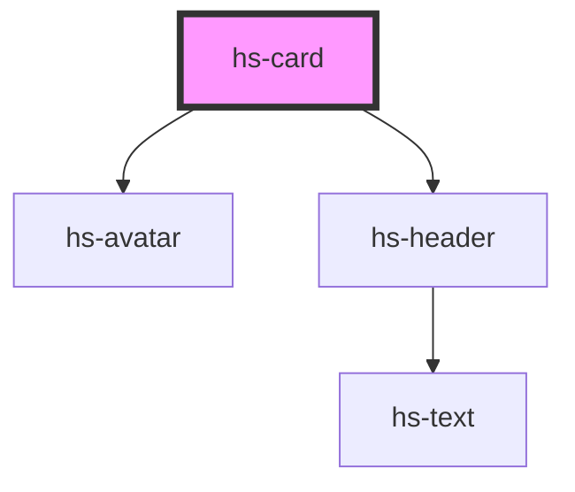

# hs-card

<!-- Auto Generated Below -->

## Properties

| Property    | Attribute   | Description | Type     | Default                                  |
| ----------- | ----------- | ----------- | -------- | ---------------------------------------- |
| `cardtitle` | `cardtitle` |             | `string` | `'Title goes here'`                      |
| `image`     | `image`     |             | `string` | `'https://thisartworkdoesnotexist.com/'` |
| `subtitle`  | `subtitle`  |             | `string` | `'Subtitle goes here'`                   |

## Dependencies

### Depends on

- [hs-avatar](../hs-avatar)
- [hs-header](../hs-header)

### Graph

----------------------------------------------

*Built with [StencilJS](https://stenciljs.com/)*
