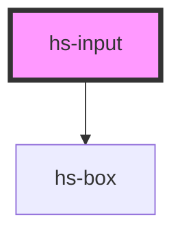

# hs-input

<!-- Auto Generated Below -->

## Properties

| Property       | Attribute      | Description | Type                                                          | Default  |
| -------------- | -------------- | ----------- | ------------------------------------------------------------- | -------- |
| `helptext`     | `helptext`     |             | `string`                                                      | `''`     |
| `helptexttype` | `helptexttype` |             | `"error" \| "info"`                                           | `'info'` |
| `itemid`       | `itemid`       |             | `string`                                                      | `''`     |
| `label`        | `label`        |             | `string`                                                      | `''`     |
| `type`         | `type`         |             | `"checkbox" \| "password" \| "radio" \| "text" \| "textarea"` | `'text'` |

## Dependencies

### Depends on

- [hs-box](../hs-box)

### Graph

----------------------------------------------

*Built with [StencilJS](https://stenciljs.com/)*
