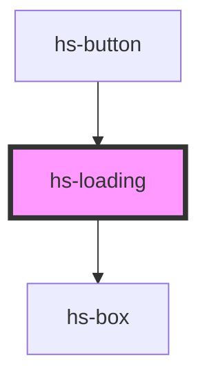

# hs-loading

<!-- Auto Generated Below -->

## Properties

| Property | Attribute | Description | Type                                                                                                                                                                                                                                                                                                                                                                                            | Default         |
| -------- | --------- | ----------- | ----------------------------------------------------------------------------------------------------------------------------------------------------------------------------------------------------------------------------------------------------------------------------------------------------------------------------------------------------------------------------------------------- | --------------- |
| `color`  | `color`   |             | `"white" \| "primary-50" \| "primary-100" \| "primary-300" \| "primary-400" \| "primary-500" \| "primary-600" \| "primary-700" \| "primary-900" \| "primary-800" \| "black" \| "neutral-50" \| "neutral-100" \| "neutral-200" \| "neutral-500" \| "neutral-700" \| "neutral-900" \| "success-50" \| "success-500" \| "danger-50" \| "danger-500" \| "warning-50" \| "warning-500" \| "overlay"` | `'primary-500'` |
| `size`   | `size`    |             | `number`                                                                                                                                                                                                                                                                                                                                                                                        | `1`             |

## Dependencies

### Used by

 - [hs-button](../hs-button)

### Depends on

- [hs-box](../hs-box)

### Graph

----------------------------------------------

*Built with [StencilJS](https://stenciljs.com/)*
