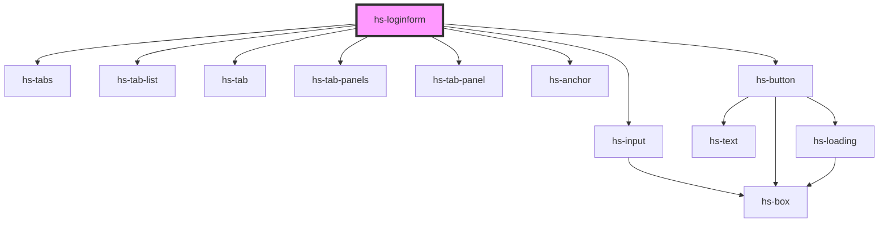

# hs-loginform

<!-- Auto Generated Below -->

## Dependencies

### Depends on

- [hs-tabs](../hs-tabs)
- [hs-tab-list](../hs-tabs)
- [hs-tab](../hs-tabs)
- [hs-tab-panels](../hs-tabs)
- [hs-tab-panel](../hs-tabs)
- [hs-input](../hs-input)
- [hs-anchor](../hs-anchor)
- [hs-button](../hs-button)

### Graph

----------------------------------------------

*Built with [StencilJS](https://stenciljs.com/)*
