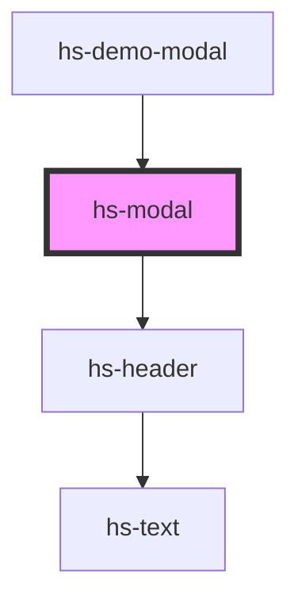

# hs-modal

<!-- Auto Generated Below -->

## Properties

| Property     | Attribute    | Description | Type      | Default         |
| ------------ | ------------ | ----------- | --------- | --------------- |
| `modaltitle` | `modaltitle` |             | `string`  | `'Modal Title'` |
| `open`       | `open`       |             | `boolean` | `false`         |

## Dependencies

### Used by

 - [hs-demo-modal](.)

### Depends on

- [hs-header](../hs-header)

### Graph

----------------------------------------------

*Built with [StencilJS](https://stenciljs.com/)*
