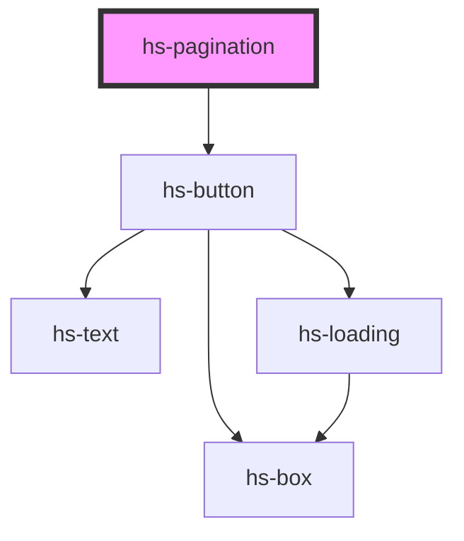

# hs-pagination

<!-- Auto Generated Below -->

## Properties

| Property      | Attribute     | Description | Type     | Default |
| ------------- | ------------- | ----------- | -------- | ------- |
| `currentpage` | `currentpage` |             | `number` | `1`     |
| `totalpages`  | `totalpages`  |             | `number` | `5`     |

## Dependencies

### Depends on

- [hs-button](../hs-button)

### Graph

----------------------------------------------

*Built with [StencilJS](https://stenciljs.com/)*
