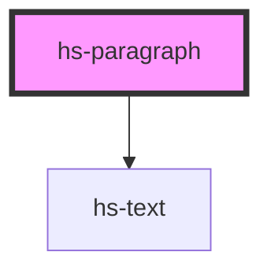

# hs-paragraph

<!-- Auto Generated Below -->

## Properties

| Property | Attribute | Description | Type                                         | Default     |
| -------- | --------- | ----------- | -------------------------------------------- | ----------- |
| `align`  | `align`   |             | `"center" \| "justify" \| "left" \| "right"` | `'left'`    |
| `color`  | `color`   |             | `"neutral" \| "primary" \| "white"`          | `'neutral'` |
| `type`   | `type`    |             | `"lg" \| "md" \| "sm"`                       | `'sm'`      |

## Dependencies

### Depends on

- [hs-text](../hs-text)

### Graph

----------------------------------------------

*Built with [StencilJS](https://stenciljs.com/)*
