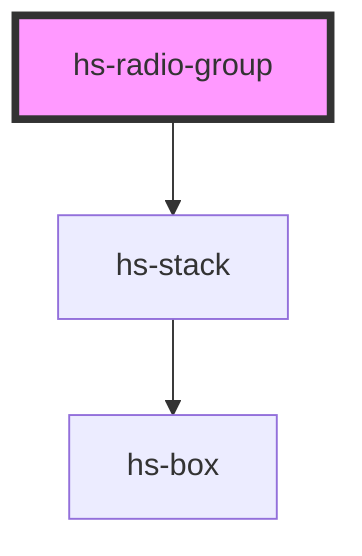

# hs-radio-group

<!-- Auto Generated Below -->

## Properties

| Property    | Attribute   | Description | Type             | Default |
| ----------- | ----------- | ----------- | ---------------- | ------- |
| `direction` | `direction` |             | `"col" \| "row"` | `'col'` |

## Dependencies

### Depends on

- [hs-stack](../hs-stack)

### Graph

----------------------------------------------

*Built with [StencilJS](https://stenciljs.com/)*
