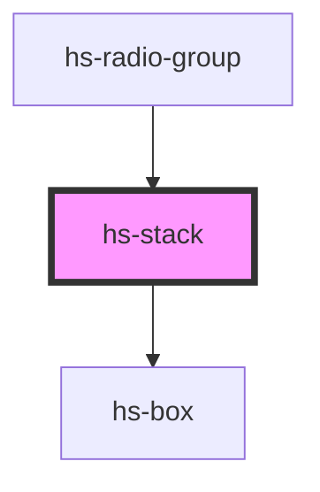

# hs-stack

<!-- Auto Generated Below -->

## Properties

| Property    | Attribute   | Description | Type             | Default |
| ----------- | ----------- | ----------- | ---------------- | ------- |
| `direction` | `direction` |             | `"col" \| "row"` | `'col'` |
| `spacing`   | `spacing`   |             | `string`         | `'0'`   |

## Dependencies

### Used by

 - [hs-radio-group](../hs-radio-group)

### Depends on

- [hs-box](../hs-box)

### Graph

----------------------------------------------

*Built with [StencilJS](https://stenciljs.com/)*
