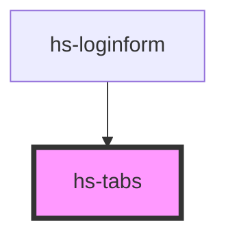

# hs-tabs

<!-- Auto Generated Below -->

## Properties

| Property        | Attribute        | Description                                                  | Type     | Default |
| --------------- | ---------------- | ------------------------------------------------------------ | -------- | ------- |
| `selectedIndex` | `selected-index` | Configures the tab/panels to select by default upon loading. | `number` | `0`     |

## Dependencies

### Used by

 - [hs-loginform](../hs-loginform)

### Graph

----------------------------------------------

*Built with [StencilJS](https://stenciljs.com/)*
