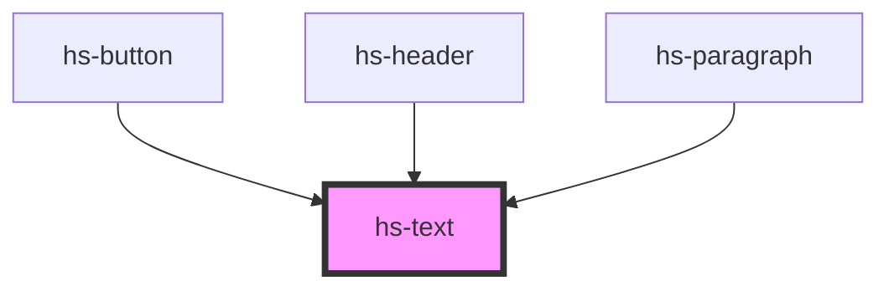

# hs-text

<!-- Auto Generated Below -->

## Properties

| Property | Attribute | Description | Type                                                                                                                                                                                                                                                                                                                                                                               | Default             |
| -------- | --------- | ----------- | ---------------------------------------------------------------------------------------------------------------------------------------------------------------------------------------------------------------------------------------------------------------------------------------------------------------------------------------------------------------------------------- | ------------------- |
| `align`  | `align`   |             | `"center" \| "justify" \| "left" \| "right"`                                                                                                                                                                                                                                                                                                                                       | `'left'`            |
| `as`     | `as`      |             | `"small" \| "sub" \| "sup" \| "blockquote" \| "caption" \| "cite" \| "code" \| "del" \| "dfn" \| "em" \| "h1" \| "h2" \| "h3" \| "h4" \| "h5" \| "h6" \| "i" \| "ins" \| "kbd" \| "label" \| "legend" \| "mark" \| "p" \| "pre" \| "q" \| "s" \| "samp" \| "span" \| "strong" \| "time" \| "u" \| "var"`                                                                           | `'span' as TextTag` |
| `class`  | `class`   |             | `string`                                                                                                                                                                                                                                                                                                                                                                           | `undefined`         |
| `color`  | `color`   |             | `"primary-50" \| "primary-100" \| "primary-300" \| "primary-400" \| "primary-500" \| "primary-600" \| "primary-700" \| "primary-900" \| "primary-800" \| "white" \| "black" \| "neutral-50" \| "neutral-100" \| "neutral-200" \| "neutral-500" \| "neutral-700" \| "neutral-900" \| "success-50" \| "success-500" \| "danger-50" \| "danger-500" \| "warning-50" \| "warning-500"` | `'black' as Color`  |
| `size`   | `size`    |             | `number`                                                                                                                                                                                                                                                                                                                                                                           | `1`                 |
| `weight` | `weight`  |             | `"400" \| "500" \| "700" \| "bold" \| "normal"`                                                                                                                                                                                                                                                                                                                                    | `'500'`             |

## Dependencies

### Used by

 - [hs-button](../hs-button)
 - [hs-header](../hs-header)
 - [hs-paragraph](../hs-paragraph)

### Graph

----------------------------------------------

*Built with [StencilJS](https://stenciljs.com/)*
